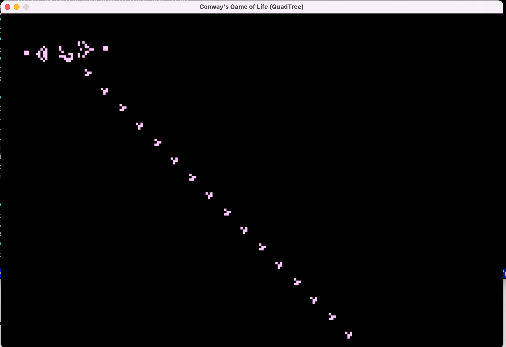

# Conway's Game of Life

Implemented with SDL and QuadTree, tested on OSX.


## Usage

```
$ make
$ ./game examples/gosper_glider_gun.json > output.life

```

After started GUI, press SPACE to start.

You can use the arrow key (Up/Down/Left/Right) to change observation window position.


